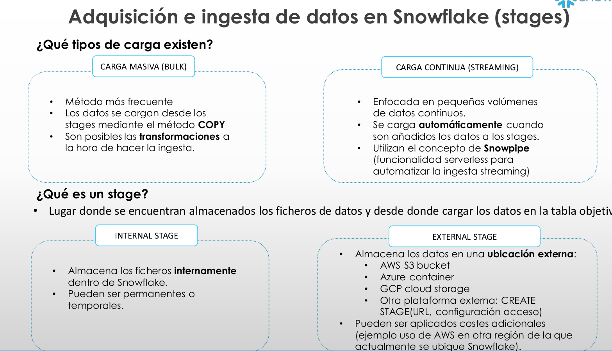
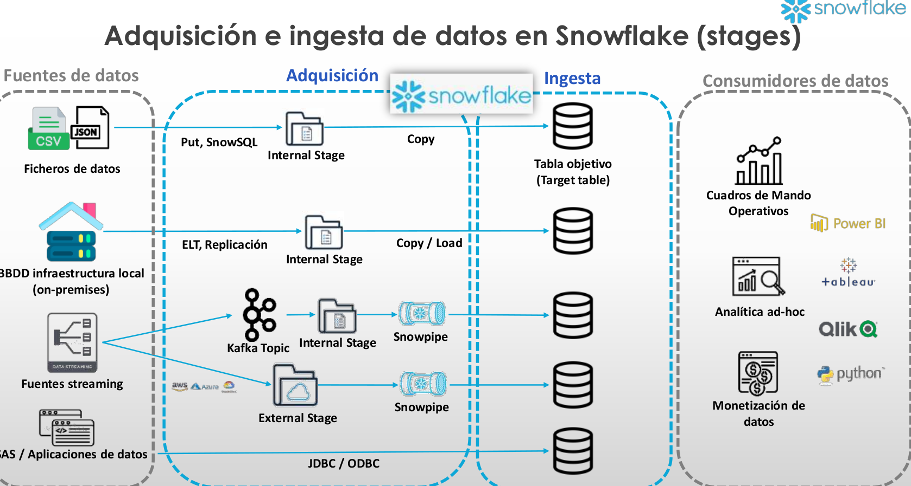
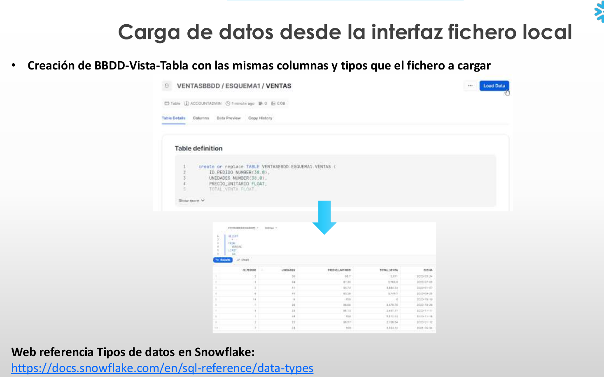

# 2-Carga-de-Datos

1. [Adquisición e ingesta de datos en Snowflake (stages)](#schema1)
2. [Carga de datos desde la interfaz fichero local](#schema2)
3. [Cómo crear un stage](#schema3)
4. [Carga de datos utilizando el comando COPY](#schema4)
5. [Transformación de datos](#schema5)
6. [Manejo de errores - Opción COPY: "ON_ERROR"](#schema6)

<hr>

<a name="schema1"></a>

## 1. Adquisición e ingesta de datos en Snowflake (stages)





<hr>

<a name="schema2"></a>

## 2. Carga de datos desde la interfaz fichero local


<hr>

<a name="schema3"></a>


## 3. Cómo crear un stage

1. Crear Database para gestión de stages, fileformats, etc.


```sql
CREATE OR REPLACE DATABASE MANAGE_DB;

CREATE OR REPLACE SCHEMA external_stages;
```

2. Crear external stage
```sql
CREATE OR REPLACE STAGE MANAGE_DB.external_stages.aws_stage
    url='s3://bucketsnowflakes3'
    credentials=(aws_key_id='ABCD_DUMMY_ID' aws_secret_key='1234abcd_key');
```
3. Descripción del external stage
```sql
DESC STAGE MANAGE_DB.external_stages.aws_stage; 
```    
    
4. Modificar external stage   
```sql
ALTER STAGE aws_stage
    SET credentials=(aws_key_id='XYZ_DUMMY_ID' aws_secret_key='987xyz');
```    
    
5. Eliminar credenciales puesto que es un fichero público    
```sql
CREATE OR REPLACE STAGE MANAGE_DB.external_stages.aws_stage
    url='s3://bucketsnowflakes3';
```
6. Listar los ficheros en el stage
```sql
LIST @aws_stage;
```

### **CARGA DE DATOS UTILIZANDO EL COMANDO COPY**

7. Crear tabla de datos ORDERS
```sql
CREATE OR REPLACE TABLE PRIMERABBDD.PRIMERESQUEMA.ORDERS (
    ORDER_ID VARCHAR(30),
    AMOUNT INT,
    PROFIT INT,
    QUANTITY INT,
    CATEGORY VARCHAR(30),
    SUBCATEGORY VARCHAR(30));
```
8. Uso de COPY con la sentencia de contexto completo
```sql
COPY INTO PRIMERABBDD.PRIMERESQUEMA.ORDERS
    FROM @MANAGE_DB.external_stages.aws_stage
    file_format= (type = csv field_delimiter=',' skip_header=1)
    files = ('OrderDetails.csv');
```

9. Uso de COPY utilizando un patrón para el nombre del fichero (carga = 0 puesto que detecta que ya se ha cargado el fichero coincidente previamente)
```sql
COPY INTO PRIMERABBDD.PRIMERESQUEMA.ORDERS
    FROM @MANAGE_DB.external_stages.aws_stage
    file_format= (type = csv field_delimiter=',' skip_header=1)
    pattern='.*Order.*';
```
### **TRANSFORMACIÓN DE DATOS**
- Ejemplo 1 seleccionar columnas - Tabla
```sql
CREATE OR REPLACE TABLE PRIMERABBDD.PRIMERESQUEMA.ORDERS_EX (
    ORDER_ID VARCHAR(30),
    AMOUNT INT
    )

COPY INTO PRIMERABBDD.PRIMERESQUEMA.ORDERS_EX
    FROM (select s.$1, s.$2 from @MANAGE_DB.external_stages.aws_stage s)
    file_format= (type = csv field_delimiter=',' skip_header=1)
    files=('OrderDetails.csv');


SELECT * FROM PRIMERABBDD.PRIMERESQUEMA.ORDERS_EX;
```   
- Ejemplo 2 Uso de función SQL para columna nueva calculada - Tabla    
```sql
CREATE OR REPLACE TABLE PRIMERABBDD.PRIMERESQUEMA.ORDERS_EX (
    ORDER_ID VARCHAR(30),
    AMOUNT INT,
    PROFIT INT,
    PROFITABLE_FLAG VARCHAR(30)
  
    )

COPY INTO PRIMERABBDD.PRIMERESQUEMA.ORDERS_EX
    FROM (select 
            s.$1,
            s.$2, 
            s.$3,
            CASE WHEN CAST(s.$3 as int) < 0 THEN 'not profitable' ELSE 'profitable' END 
          from @MANAGE_DB.external_stages.aws_stage s)
    file_format= (type = csv field_delimiter=',' skip_header=1)
    files=('OrderDetails.csv');


SELECT * FROM PRIMERABBDD.PRIMERESQUEMA.ORDERS_EX
```

- Ejemplo 3 Seleccionar Substring de una columna - Tabla
```sql
CREATE OR REPLACE TABLE PRIMERABBDD.PRIMERESQUEMA.ORDERS_EX (
    ORDER_ID VARCHAR(30),
    AMOUNT INT,
    PROFIT INT,
    CATEGORY_SUBSTRING VARCHAR(5)
  
    )

COPY INTO PRIMERABBDD.PRIMERESQUEMA.ORDERS_EX
    FROM (select 
            s.$1,
            s.$2, 
            s.$3,
            substring(s.$5,1,5) 
          from @MANAGE_DB.external_stages.aws_stage s)
    file_format= (type = csv field_delimiter=',' skip_header=1)
    files=('OrderDetails.csv');


SELECT * FROM PRIMERABBDD.PRIMERESQUEMA.ORDERS_EX
```

- Ejemplo 4 Utilizar un conjunto de columnas y el resto vacías
```sql
CREATE OR REPLACE TABLE PRIMERABBDD.PRIMERESQUEMA.ORDERS_EX (
    ORDER_ID VARCHAR(30),
    AMOUNT INT,
    PROFIT INT,
    PROFITABLE_FLAG VARCHAR(30)
  
    )

COPY INTO PRIMERABBDD.PRIMERESQUEMA.ORDERS_EX (ORDER_ID,PROFIT)
    FROM (select 
            s.$1,
            s.$3
          from @MANAGE_DB.external_stages.aws_stage s)
    file_format= (type = csv field_delimiter=',' skip_header=1)
    files=('OrderDetails.csv');

SELECT * FROM PRIMERABBDD.PRIMERESQUEMA.ORDERS_EX;
```

- Ejemplo 5 Añadir columna con autoincremento de ID
```sql
CREATE OR REPLACE TABLE PRIMERABBDD.PRIMERESQUEMA.ORDERS_EX (
    ORDER_ID number autoincrement start 1 increment 1,
    AMOUNT INT,
    PROFIT INT,
    PROFITABLE_FLAG VARCHAR(30)
  
    )

COPY INTO PRIMERABBDD.PRIMERESQUEMA.ORDERS_EX (PROFIT,AMOUNT)
    FROM (select 
            s.$2,
            s.$3
          from @MANAGE_DB.external_stages.aws_stage s)
    file_format= (type = csv field_delimiter=',' skip_header=1)
    files=('OrderDetails.csv');


SELECT * FROM PRIMERABBDD.PRIMERESQUEMA.ORDERS_EX WHERE ORDER_ID > 15;


    
DROP TABLE PRIMERABBDD.PRIMERESQUEMA.ORDERS_EX
```


<hr>

<a name="schema4"></a>


## 4. Carga de datos utilizando el comando COPY

1. Crear tabla
```sql
CREATE OR REPLACE TABLE PRIMERABBDD.PRIMERESQUEMA.ORDERS (
    ORDER_ID VARCHAR(30),
    AMOUNT INT,
    PROFIT INT,
    QUANTITY INT,
    CATEGORY VARCHAR(30),
    SUBCATEGORY VARCHAR(30));
    
SELECT * FROM PRIMERABBDD.PRIMERESQUEMA.ORDERS;
```   

2. Primer comando COPY
```sql
COPY INTO PRIMERABBDD.PRIMERESQUEMA.ORDERS
    FROM @MANAGE_DB.external_stages.aws_stage
    file_format= (type = csv field_delimiter=',' skip_header=1);
```

3. Listar ficheros del stage
```sql
LIST @MANAGE_DB.external_stages.aws_stage;    
```

4. Comando COPY especificando el fichero
```sql
COPY INTO PRIMERABBDD.PRIMERESQUEMA.ORDERS
    FROM @MANAGE_DB.external_stages.aws_stage
    file_format= (type = csv field_delimiter=',' skip_header=1)
    files = ('OrderDetails.csv');
```

5. Comando COPY a partir de un patrón
```sql
COPY INTO PRIMERABBDD.PRIMERESQUEMA.ORDERS
    FROM @MANAGE_DB.external_stages.aws_stage
    file_format= (type = csv field_delimiter=',' skip_header=1)
    pattern='.*Order.*';
```
<hr>

<a name="schema5"></a>


## 5. Transformación de datos

- Ejemplo 1 seleccionar columnas - Tabla
```sql
CREATE OR REPLACE TABLE PRIMERABBDD.PRIMERESQUEMA.ORDERS_EX (
    ORDER_ID VARCHAR(30),
    AMOUNT INT
    )

COPY INTO PRIMERABBDD.PRIMERESQUEMA.ORDERS_EX
    FROM (select s.$1, s.$2 from @MANAGE_DB.external_stages.aws_stage s)
    file_format= (type = csv field_delimiter=',' skip_header=1)
    files=('OrderDetails.csv');


SELECT * FROM PRIMERABBDD.PRIMERESQUEMA.ORDERS_EX;
``` 
- Ejemplo 2 Uso de función SQL para columna nueva calculada - Tabla    
```sql
CREATE OR REPLACE TABLE PRIMERABBDD.PRIMERESQUEMA.ORDERS_EX (
    ORDER_ID VARCHAR(30),
    AMOUNT INT,
    PROFIT INT,
    PROFITABLE_FLAG VARCHAR(30)
  
    )

COPY INTO PRIMERABBDD.PRIMERESQUEMA.ORDERS_EX
    FROM (select 
            s.$1,
            s.$2, 
            s.$3,
            CASE WHEN CAST(s.$3 as int) < 0 THEN 'not profitable' ELSE 'profitable' END 
          from @MANAGE_DB.external_stages.aws_stage s)
    file_format= (type = csv field_delimiter=',' skip_header=1)
    files=('OrderDetails.csv');


SELECT * FROM PRIMERABBDD.PRIMERESQUEMA.ORDERS_EX
```

<hr>

<a name="schema6"></a>


## 6. Manejo de errores - Opción COPY: "ON_ERROR"
